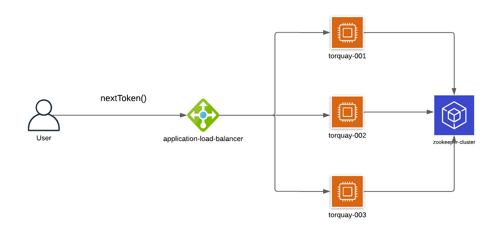

# Torquay

Torquay (pronounced taw-kee) is a simple distributed counter as a web service. It is a highly available and scalable service for generating a monotonically increasing 
sequence of numbers (tokens). It uses [Apache Zookeeper](https://zookeeper.apache.org/) to maintain a distributed state as a simple atomic increment API. 
Torquay exposes a REST API to consume the distributed counter. A distributed counter is a handy abstraction for solving recurring problems in microservices. A good use case
for such a counter is to implement a highly available URL shortner. The token can feed into the generation of the next available URL slug.
[More ways to implement such counters](https://systemdesign.one/distributed-counter-system-design/).



## Usage

### Running Torquay

```bash
# Running with docker (runs two instances of the service by default)
$ docker compose up

# OR

# Running natively (assumes a zookeeper instance running)
$ go build -o main ./cmd/main.go
$ ./main

```

### Getting next token

```http
GET /api/v1/token

{
  "token": 53
}
```

## Contributing

Pull requests are welcome. For major changes, please open an issue first
to discuss what you would like to change.

Please make sure to update tests as appropriate.

## License

[Apache 2.0](https://raw.githubusercontent.com/godcrampy/torquay/master/LICENSE)